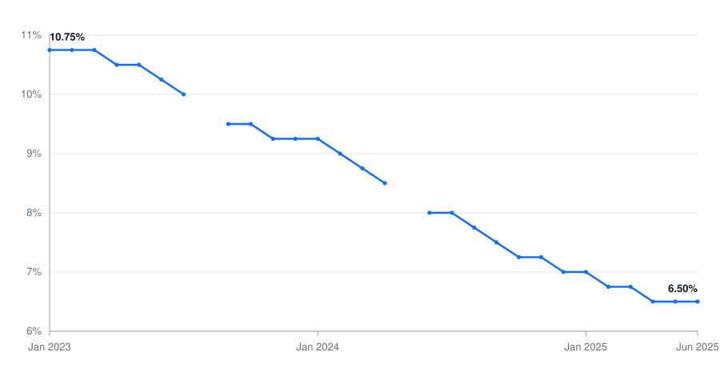

<!-- _class: lead -->

# The CBA Refinancing Rate
## Two and a half years of easing, 2023 → 2026

A read of the Central Bank of Armenia's monthly refinancing rate, from a cleaned
series (Jan 2023 – Jun 2025) and the current official figure.

Central-Bank Rate Analysis Kit · prepared 2026-07-21

---

## Executive summary

**Situation.** This reviews the CBA refinancing rate over Jan 2023 – Jun 2025 (a cleaned monthly series, DS-002) and states where it stands today (WRB-002).

**Key findings.**
- The rate was reduced from **10.75%** (Jan 2023) to **6.50%** (Jun 2025) — a fall of **4.25 pp (425 bp)**.
- It has **stayed at 6.50%** since — the current official CBA refinancing rate is **6.50%**, held on 2026-06-16 (unchanged since 2025-12-16).

**Cause → effect.** The decline was gradual and stepwise (mostly 25 bp moves), consistent with a disinflation-phase easing cycle; the reasons behind each CBA decision are **not sourced in this pack** (see caveats) and are not asserted here.

**Implication.** The easing cycle has paused: the rate has been flat at 6.50% for over a year through mid-2026.

**Recommendation.** Treat the historical series as **illustrative** and refresh it from official CBA releases before any figure is published externally.

---

## The trajectory: a steady, stepwise decline

CHT-001 · monthly CBA refinancing rate, from cleaned series DS-002. Two months (Aug 2023, May 2024) are unobserved in the source sample and are shown as breaks, not interpolated.

---

## Where the rate stands now

6.50%

**Current CBA refinancing rate**, held at the 2026-06-16 decision — unchanged since 2025-12-16 (WRB-002 · WRS-015, official CBA press release, corroborated).

- This is the **same level** the cleaned series reaches at its end (Jun 2025 = 6.50%), so the rate has now held flat for **more than a year**.
- The easing that ran through 2023–2024 has given way to a **hold**.

The current figure is P0 (issuing bank) read via an official-quoting snippet and corroborated; confidence: Workable. The historical series is illustrative (P4) — see caveats.

---

## Monthly detail (cleaned series, DS-002)

| Month | Rate | Month | Rate | Month | Rate |
|---|---|---|---|---|---|
| 2023-01 | 10.75 | 2023-11 | 9.25 | 2024-09 | 7.5 |
| 2023-02 | 10.75 | 2023-12 | 9.25 | 2024-10 | 7.25 |
| 2023-03 | 10.75 | 2024-01 | 9.25 | 2024-11 | 7.25 |
| 2023-04 | 10.5 | 2024-02 | 9.0 | 2024-12 | 7.0 |
| 2023-05 | 10.5 | 2024-03 | 8.75 | 2025-01 | 7.0 |
| 2023-06 | 10.25 | 2024-04 | 8.5 | 2025-02 | 6.75 |
| 2023-07 | 10.0 | 2024-05 | *(n/a)* | 2025-03 | 6.75 |
| 2023-08 | *(n/a)* | 2024-06 | 8.0 | 2025-04 | 6.5 |
| 2023-09 | 9.5 | 2024-07 | 8.0 | 2025-05 | 6.5 |
| 2023-10 | 9.5 | 2024-08 | 7.75 | 2025-06 | 6.5 |

Values in %. *(n/a)* = month not observed in the source sample; left blank, not estimated.

---

## Data quality & method

The source file was the shipped **illustrative** CBA sample — dirty by design. It was cleaned via a throwaway script and independently re-verified before any figure here was used (`analysis/cba-refinance-rate-cleaning-log.md`).

| Issue found | Fix |
|---|---|
| `2023-09` recorded as **95.0** | Corrected to **9.5** (decimal-place typo; only value fitting neighbours 10.0 → 9.5 → 9.25) |
| Two blanks (2023-08, 2024-05) | **Left blank** — a policy rate moves in discrete decisions, so interpolation would fabricate a figure |
| Duplicate 2024-01 row | Removed the duplicate |
| `7.25%` string; mixed date formats (`01/03/2023`, `March 2024`, `2024/09/01`) | Normalised to numeric / ISO dates |

Independent verification recomputed from the raw cells and asserted equality — verdict PASS. clean-qa: PASS (2 rounds).

---

## Sources & caveats

**Sources**
- **DS-002** — cleaned CBA monthly refinancing-rate series, `data/cba-refinance-rate-cleaned.csv` (provenance **SRC-001**, shipped illustrative sample).
- **WRB-002 / WRS-015** — current CBA refinancing rate (6.50%), official CBA press release, 2026-06-16.
- **CHT-001** — trend chart, generated from DS-002. Cleaning log: `analysis/cba-refinance-rate-cleaning-log.md`.

**Caveats (read before external use)**
- The **historical series is illustrative (tier P4)** — not authoritative. **Refresh from official CBA data before publishing** any historical figure. Confidence: Shaky.
- Two months are unobserved and shown as gaps, not estimated.
- The **drivers** of the CBA's decisions (inflation, FX, growth) are **not sourced** in this pack; no rationale is asserted.
- The current 6.50% was read via an official-quoting snippet (the CBA site blocked direct fetch); corroborated — confidence Workable.
